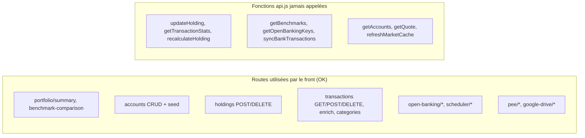

# Audit PatriMon — Backend FastAPI + Frontend React

Périmètre : ~11 000 lignes (backend `app/` complet, frontend `src/` complet, infra). Aucun code modifié.
Objectif : dire ce qui est bien, ce qui doit changer, et vérifier la cohérence **routes ↔ services ↔ appels front**.

**Verdict global** : l'architecture est saine et la logique métier « patrimoine » est sérieuse (PRU en EUR historisé, XIRR, dédoublonnage des imports). Par contre il y a **un problème de sécurité critique** (secrets commités + clé privée exposée par l'API), **plusieurs erreurs de calcul financier** (TWR, historique, suppression de transaction) et un **couplage fort à votre machine** (chemins Windows, IDs de comptes en dur).

---

## 1. Ce qui est bien ✅

| Domaine | Point fort |
|---|---|
| Architecture | Découpage clair `routers/` → `services/` → `models.py`, schémas SQLModel `Create/Read/Update` séparés |
| Multi-devises | `unit_cost_eur` figé à l'achat : le P&L ne bouge pas avec le taux de change du jour (bonne pratique) |
| PRU | PRU pondéré + plus-value réalisée sur vente + recalcul depuis l'historique ([transaction_service.py](file:///c:/Users/Borel/Desktop/Suivie_Patrimoine/backend/app/services/transaction_service.py)) |
| Performance | XIRR robuste (Newton-Raphson + repli par dichotomie) ([performance_service.py](file:///c:/Users/Borel/Desktop/Suivie_Patrimoine/backend/app/services/performance_service.py#L26-L105)) |
| Imports | Dédoublonnage via `external_id`, `md5Checksum` Drive et `DriveSyncLog` |
| Snapshots | Un snapshot par jour, mis à jour (upsert) et non dupliqué |
| Config | Variables d'environnement + cache TTL configurables ([config.py](file:///c:/Users/Borel/Desktop/Suivie_Patrimoine/backend/app/config.py)) |
| Open Banking | Mode simulation complet, utile pour développer sans banque réelle |
| Frontend | Couche API centralisée ([api.js](file:///c:/Users/Borel/Desktop/Suivie_Patrimoine/frontend/src/services/api.js)), proxy Vite, debounce sur la recherche, protection `isMounted` sur le benchmark, UX soignée |
| Cohérence des routes | **Tous les appels du front correspondent à une route backend existante** (aucun 404 trouvé) |

---

## 2. Critique — Sécurité 🔴

> [!CAUTION]
> **Secrets commités dans git** (dépôt `Borelioeldos/PatriMon`). Il n'y a **aucun `.gitignore`**. Sont versionnés :
> - `backend/certs/enable_banking_private.pem` (clé privée RSA)
> - `backend/open_banking_config.json` (Application ID **et** clé privée Enable Banking en clair)
> - `backend/patrimoines.db` (toutes vos données patrimoniales)
> - 9 629 fichiers `node_modules/`, tous les `__pycache__/*.pyc`, `frontend/dist/`
>
> Si le dépôt est (ou a été) public, la clé Enable Banking doit être **considérée comme compromise et régénérée**.

| # | Problème | Où |
|---|---|---|
| S1 | `POST /api/open-banking/generate-keys` **renvoie la clé privée** dans la réponse HTTP, et le front la stocke dans son état | [open_banking.py:L68-L105](file:///c:/Users/Borel/Desktop/Suivie_Patrimoine/backend/app/routers/open_banking.py#L68-L105), [BankSyncModal.jsx:L193-L195](file:///c:/Users/Borel/Desktop/Suivie_Patrimoine/frontend/src/components/BankSyncModal.jsx#L193-L195) |
| S2 | Aucune authentification + backend et Vite écoutent sur `0.0.0.0` → toute personne sur votre réseau local voit votre patrimoine et peut récupérer la clé | [config.py:L16](file:///c:/Users/Borel/Desktop/Suivie_Patrimoine/backend/app/config.py#L16), [vite.config.js](file:///c:/Users/Borel/Desktop/Suivie_Patrimoine/frontend/vite.config.js) |
| S3 | CORS `*` combiné à `allow_credentials=True` | [config.py:L20](file:///c:/Users/Borel/Desktop/Suivie_Patrimoine/backend/app/config.py#L20), [main.py:L26-L32](file:///c:/Users/Borel/Desktop/Suivie_Patrimoine/backend/app/main.py#L26-L32) |
| S4 | `/status` renvoie l'`application_id` complet en plus de sa version masquée (le masquage ne sert à rien) | [open_banking_service.py:L162-L163](file:///c:/Users/Borel/Desktop/Suivie_Patrimoine/backend/app/services/open_banking_service.py#L162-L163) |
| S5 | Le service Drive lit et **réécrit le fichier de jetons OAuth de votre IDE** (`C:\Users\Borel\.gemini\...\mcp_oauth_tokens.json`) | [google_drive_service.py:L24-L25](file:///c:/Users/Borel/Desktop/Suivie_Patrimoine/backend/app/services/google_drive_service.py#L24-L25), [L86-L90](file:///c:/Users/Borel/Desktop/Suivie_Patrimoine/backend/app/services/google_drive_service.py#L86-L90) |

---

## 3. Backend — bugs et incohérences

### 3.1 Bugs avérés 🐞

| # | Bug | Effet | Où |
|---|---|---|---|
| B1 | `serialization` est utilisé mais **jamais importé** dans `open_banking_service.py` | `get_public_key()` lève `NameError`, avalée par le `try` → la clé publique dérivée est toujours vide | [L88-L91](file:///c:/Users/Borel/Desktop/Suivie_Patrimoine/backend/app/services/open_banking_service.py#L81-L97) vs imports [L6-L18](file:///c:/Users/Borel/Desktop/Suivie_Patrimoine/backend/app/services/open_banking_service.py#L6-L18) |
| B2 | Historique : `order_by(asc).limit(90)` renvoie les **90 plus anciens** snapshots | Au-delà de 90 jours, la courbe d'évolution se fige dans le passé | [portfolio_service.py:L221-L225](file:///c:/Users/Borel/Desktop/Suivie_Patrimoine/backend/app/services/portfolio_service.py#L221-L225) |
| B3 | Supprimer une transaction **n'annule pas** son effet sur la quantité, le PRU ni le cash | Les soldes dérivent après chaque suppression | [transactions.py:L133-L142](file:///c:/Users/Borel/Desktop/Suivie_Patrimoine/backend/app/routers/transactions.py#L133-L142) |
| B4 | `Holding.transactions` a `cascade_delete=True` | Supprimer une position **efface tout son historique** (plus-values réalisées, dividendes) | [models.py:L127-L130](file:///c:/Users/Borel/Desktop/Suivie_Patrimoine/backend/app/models.py#L127-L130) |
| B5 | `recalculate_holding_pru` repart de 0 et ignore la quantité initiale d'une position créée sans transaction | Un import d'avis d'opéré (Bourso/Revolut) sur une position existante **écrase la quantité** par celle de ce seul ordre | [transaction_service.py:L246-L291](file:///c:/Users/Borel/Desktop/Suivie_Patrimoine/backend/app/services/transaction_service.py#L246-L291), appelé par [bourso_trade_parser.py:L246](file:///c:/Users/Borel/Desktop/Suivie_Patrimoine/backend/app/services/bourso_trade_parser.py#L244-L248), [revolut_csv_parser.py:L357-L361](file:///c:/Users/Borel/Desktop/Suivie_Patrimoine/backend/app/services/revolut_csv_parser.py#L356-L361) |
| B6 | Vente sans `unit_price` (montant seul) → `price_eur = 0` | Plus-value réalisée = −(PRU × qté) : faux | [transaction_service.py:L127-L134](file:///c:/Users/Borel/Desktop/Suivie_Patrimoine/backend/app/services/transaction_service.py#L127-L134) |
| B7 | Nouvelle position : `unit_cost` sans frais, `unit_cost_eur` avec frais ; position existante : les deux avec frais | PRU incohérent selon le cas | [L105-L113](file:///c:/Users/Borel/Desktop/Suivie_Patrimoine/backend/app/services/transaction_service.py#L105-L113) vs [L93](file:///c:/Users/Borel/Desktop/Suivie_Patrimoine/backend/app/services/transaction_service.py#L93) |
| B8 | Cache devises : **un seul timestamp** pour toutes les devises, remis à zéro à chaque fetch | Un taux USD peut rester périmé indéfiniment si GBP est rafraîchi | [market_service.py:L31-L33](file:///c:/Users/Borel/Desktop/Suivie_Patrimoine/backend/app/services/market_service.py#L31-L49) |
| B9 | Benchmark : le paramètre `period` filtre l'indice mais **pas les snapshots** | Base de comparaison décalée (portefeuille depuis le début vs indice depuis 1 mois) | [benchmark_service.py:L85-L111](file:///c:/Users/Borel/Desktop/Suivie_Patrimoine/backend/app/services/benchmark_service.py#L85-L111) |
| B10 | Catégorie `"Revenus de capitaux"` (Revolut) absente de `ALL_CATEGORIES` | Le filtre par catégorie du front ne la retrouve jamais | [revolut_csv_parser.py:L332](file:///c:/Users/Borel/Desktop/Suivie_Patrimoine/backend/app/services/revolut_csv_parser.py#L332) vs [transaction_enricher.py:L29-L42](file:///c:/Users/Borel/Desktop/Suivie_Patrimoine/backend/app/services/transaction_enricher.py#L29-L42) |

### 3.2 Calculs financiers à revoir 📐

- **TWR** : seuls les flux tombant **exactement un jour de snapshot** sont neutralisés ; un versement fait un jour sans consultation de l'appli est compté comme de la performance ([performance_service.py:L153-L166](file:///c:/Users/Borel/Desktop/Suivie_Patrimoine/backend/app/services/performance_service.py#L153-L166)). Il faut cumuler les flux de l'intervalle `]prev, curr]`.
- **Périmètre TWR/TRI mélangé** : la synchro bancaire transforme **tout crédit en DEPOSIT et tout débit en WITHDRAWAL** (salaire, courses, virements internes) ([transaction_enricher.py:L252-L255](file:///c:/Users/Borel/Desktop/Suivie_Patrimoine/backend/app/services/transaction_enricher.py#L252-L255)). Ces mouvements de consommation alimentent le TWR/TRI. Pour la performance d'investissement, il faut se limiter aux enveloppes PEA/CTO/Crypto/PEE/PERO.
- **« Investi » inclut le cash** ([portfolio_service.py:L142](file:///c:/Users/Borel/Desktop/Suivie_Patrimoine/backend/app/services/portfolio_service.py#L141-L147)) → le % de plus-value global est dilué par les livrets et comptes courants.
- **Repli trompeur** : avec moins de 2 snapshots, le « TWR » renvoyé est en fait un rendement simple ([L134-L142](file:///c:/Users/Borel/Desktop/Suivie_Patrimoine/backend/app/services/performance_service.py#L134-L142)).
- Classification : un FCPE détenu en CTO part dans « Épargne Entreprise (PEE) » ; `PERO` et `REAL_ESTATE` n'ont pas de catégorie dédiée ([L166-L178](file:///c:/Users/Borel/Desktop/Suivie_Patrimoine/backend/app/services/portfolio_service.py#L166-L178)).

### 3.3 Robustesse / performance ⚙️

| # | Problème | Où |
|---|---|---|
| R1 | `GET /portfolio/summary` **écrit en base** (snapshot) → un GET avec effet de bord | [portfolio_service.py:L202-L205](file:///c:/Users/Borel/Desktop/Suivie_Patrimoine/backend/app/services/portfolio_service.py#L202-L205) |
| R2 | Cotations récupérées **une par une**, avec `ticker.info` (appel lent) à chaque fois | [portfolio_service.py:L127-L130](file:///c:/Users/Borel/Desktop/Suivie_Patrimoine/backend/app/services/portfolio_service.py#L127-L130), [market_service.py:L99-L105](file:///c:/Users/Borel/Desktop/Suivie_Patrimoine/backend/app/services/market_service.py#L99-L105) |
| R3 | Le scheduler appelle `get_portfolio_summary` (bloquant, yfinance) **dans la boucle asyncio** → toute l'API est figée pendant la synchro | [sync_scheduler_service.py:L139-L147](file:///c:/Users/Borel/Desktop/Suivie_Patrimoine/backend/app/services/sync_scheduler_service.py#L139-L147) |
| R4 | IDs de comptes **en dur** : `pea_account_id=1`, `account_id=3` → dépend de l'ordre du seed | [google_drive_service.py:L264](file:///c:/Users/Borel/Desktop/Suivie_Patrimoine/backend/app/services/google_drive_service.py#L264), [L284](file:///c:/Users/Borel/Desktop/Suivie_Patrimoine/backend/app/services/google_drive_service.py#L284), [L324](file:///c:/Users/Borel/Desktop/Suivie_Patrimoine/backend/app/services/google_drive_service.py#L324) |
| R5 | Drive : liste **tous les fichiers du Drive** (`pageSize=200`, sans pagination) puis filtre en Python → fichiers manqués au-delà de 200 | [google_drive_service.py:L118-L128](file:///c:/Users/Borel/Desktop/Suivie_Patrimoine/backend/app/services/google_drive_service.py#L118-L128) |
| R6 | Open Banking : pas de `date_from` ni de pagination (`continuation_key`) ; on prend `balances[0]` sans choisir le type (CLBD/ITAV) ; l'`external_id` de repli (`date + montant`) fait disparaître deux opérations identiques le même jour | [open_banking_service.py:L1274-L1284](file:///c:/Users/Borel/Desktop/Suivie_Patrimoine/backend/app/services/open_banking_service.py#L1270-L1290), [L1437](file:///c:/Users/Borel/Desktop/Suivie_Patrimoine/backend/app/services/open_banking_service.py#L1436-L1443) |
| R7 | Lecture des soldes dupliquée 4 fois dans `open_banking_service.py` (1 500 lignes, dont ~280 de données de simulation) | L700-L747, L882-L905, L1432-L1443 |
| R8 | Migration « maison » par `ALTER TABLE` ; pas d'index sur `Transaction.external_id` (requêté à chaque import) | [database.py:L23-L34](file:///c:/Users/Borel/Desktop/Suivie_Patrimoine/backend/app/database.py#L23-L34) |
| R9 | Petites incohérences : le routeur Drive met `/api` dans son propre préfixe alors que les autres le reçoivent de `main.py` ; version `3.0.0` vs `1.1.0` ; `account_id: int = Query(None)` au lieu de `Optional[int]` | [main.py:L22](file:///c:/Users/Borel/Desktop/Suivie_Patrimoine/backend/app/main.py#L22), [L42](file:///c:/Users/Borel/Desktop/Suivie_Patrimoine/backend/app/main.py#L42), [L50](file:///c:/Users/Borel/Desktop/Suivie_Patrimoine/backend/app/main.py#L50), [holdings.py:L17](file:///c:/Users/Borel/Desktop/Suivie_Patrimoine/backend/app/routers/holdings.py#L17) |
| R10 | Les dépendances Python ne sont pas figées (`>=`) ; aucun test ni linter | [requirements.txt](file:///c:/Users/Borel/Desktop/Suivie_Patrimoine/backend/requirements.txt) |

---

## 4. Frontend — bugs et incohérences

| # | Problème | Où |
|---|---|---|
| F1 | Rafraîchissement auto **toutes les 30 s avec `force_refresh=true`** → contourne le cache et appelle Yahoo pour chaque ligne (risque de blocage) + écrit un snapshot à chaque fois | [App.jsx:L17](file:///c:/Users/Borel/Desktop/Suivie_Patrimoine/frontend/src/App.jsx#L17), [L89-L103](file:///c:/Users/Borel/Desktop/Suivie_Patrimoine/frontend/src/App.jsx#L89-L103) |
| F2 | `fetchPortfolio` est appelé **à l'intérieur d'un updater `setState`** (effet de bord, doublé en StrictMode) ; pas de garde contre deux requêtes simultanées | [App.jsx:L93-L97](file:///c:/Users/Borel/Desktop/Suivie_Patrimoine/frontend/src/App.jsx#L93-L97) |
| F3 | `updated_at` est l'heure **UTC** affichée telle quelle (−2 h en France) ; même problème pour `imported_at` (datetime sans fuseau) | [App.jsx:L49](file:///c:/Users/Borel/Desktop/Suivie_Patrimoine/frontend/src/App.jsx#L49), [DriveSyncModal.jsx:L356](file:///c:/Users/Borel/Desktop/Suivie_Patrimoine/frontend/src/components/DriveSyncModal.jsx#L356) |
| F4 | **Impossible de modifier une position** (quantité, PRU, prix manuel d'un FCPE) : `api.updateHolding` existe mais n'est jamais utilisé | [api.js:L65](file:///c:/Users/Borel/Desktop/Suivie_Patrimoine/frontend/src/services/api.js#L65-L73) |
| F5 | Soldes toujours formatés en **EUR**, même pour un compte USD créé par la synchro bancaire | [AccountsList.jsx:L187](file:///c:/Users/Borel/Desktop/Suivie_Patrimoine/frontend/src/components/AccountsList.jsx#L187) |
| F6 | Badge « PEE » affiché pour **toute** position manuelle (y compris une action en CTO) ; badge « DSP2 » affiché pour **tout** `external_id` (y compris imports Bourso/Revolut) | [AccountsList.jsx:L331-L335](file:///c:/Users/Borel/Desktop/Suivie_Patrimoine/frontend/src/components/AccountsList.jsx#L331-L335), [TransactionsList.jsx:L274-L281](file:///c:/Users/Borel/Desktop/Suivie_Patrimoine/frontend/src/components/TransactionsList.jsx#L274-L281) |
| F7 | KPI « Liquidités & Épargne » = cash des comptes uniquement, **sans les livrets saisis comme positions**, alors que le camembert les inclut → deux chiffres différents pour la même notion | [KPICards.jsx:L9](file:///c:/Users/Borel/Desktop/Suivie_Patrimoine/frontend/src/components/KPICards.jsx#L9) vs [portfolio_service.py:L173-L174](file:///c:/Users/Borel/Desktop/Suivie_Patrimoine/backend/app/services/portfolio_service.py#L173-L174) |
| F8 | Estimation du nouveau PRU / de la plus-value : mélange **prix en devise** et **PRU en EUR** (faux pour un titre USD) | [AddTransactionModal.jsx:L244-L258](file:///c:/Users/Borel/Desktop/Suivie_Patrimoine/frontend/src/components/AddTransactionModal.jsx#L244-L258) |
| F9 | Ajout d'actif : le PRU est saisi dans la devise choisie, mais le backend **remplace la devise** par celle de Yahoo → PRU converti à tort | [AddAssetModal.jsx:L136](file:///c:/Users/Borel/Desktop/Suivie_Patrimoine/frontend/src/components/AddAssetModal.jsx#L129-L138) vs [holdings.py:L61](file:///c:/Users/Borel/Desktop/Suivie_Patrimoine/backend/app/routers/holdings.py#L56-L70) |
| F10 | Date par défaut calculée via `toISOString()` (UTC) → décalage d'un jour entre 0 h et 2 h | [AddTransactionModal.jsx:L51](file:///c:/Users/Borel/Desktop/Suivie_Patrimoine/frontend/src/components/AddTransactionModal.jsx#L51) |
| F11 | Journal limité à 100 lignes, sans pagination ; la suppression n'avertit pas que les soldes ne seront pas corrigés (B3) | [TransactionsList.jsx:L53](file:///c:/Users/Borel/Desktop/Suivie_Patrimoine/frontend/src/components/TransactionsList.jsx#L49-L54) |
| F12 | Duplication : `formatEUR` recopié dans 8 composants, catégories recopiées en dur, libellés en dur (« BoursoBank, Revolut, BNP & PEE ») | `KPICards`, `AccountsList`, `AddTransactionModal:L9-L22`… |
| F13 | Gestion d'erreur incohérente dans `api.js` : la moitié des fonctions ignore le `detail` renvoyé par FastAPI ; commentaire « GoCardless » obsolète (c'est Enable Banking) | [api.js:L199](file:///c:/Users/Borel/Desktop/Suivie_Patrimoine/frontend/src/services/api.js#L199) |

### Cohérence front ↔ back



Toutes les routes appelées existent bien et les champs lus par le front (`performance_metrics.twr/mwr/stats`, `allocation_*`, `series`, `stats.*` Drive, `all_items/pee_items/pero_items` PEE) correspondent à ce que renvoie le backend. Le problème vient surtout de fonctions **mortes** : `updateHolding` et `recalculateHolding` manquent à l'interface, les autres peuvent être supprimées.

---

## 5. Infra / dépôt

- Pas de `.gitignore` (voir §2).
- `Dockerfile` et `docker-compose.yml` sont **supprimés localement mais toujours suivis** par git ; le README y fait peut-être encore référence.
- `start.bat` annonce `http://localhost:5173` alors que Vite utilise `basicSsl` (donc **https**).
- `reload=True` codé en dur dans `run.py` (OK en dev, pas en prod).

---

## Questions ouvertes

> [!IMPORTANT]
> 1. **Périmètre** : voulez-vous seulement ce rapport, ou que j'applique les corrections ? Si oui, quels lots (voir plan ci-dessous) ?
> 2. **Secrets dans l'historique git** : le dépôt GitHub est-il public ? Purger l'historique (`git filter-repo`) **réécrit tout l'historique** et oblige à un `push --force`. Je peux le préparer, mais c'est vous qui régénérez la clé côté Enable Banking.
> 3. **Périmètre de performance** : TWR/TRI calculés sur les **investissements seuls** (PEA/CTO/Crypto/PEE/PERO, recommandé) ou sur le **patrimoine total** comptes courants inclus ?
> 4. **Suppression d'une transaction** : faut-il **annuler automatiquement** son effet (quantité/PRU/cash), ou seulement recalculer la position depuis l'historique ?
> 5. **Docker** : la suppression du `Dockerfile` / `docker-compose.yml` est-elle volontaire ?

---

## Plan de correction proposé (sans réécriture)

Corrections **ciblées** par lots, de la plus urgente à la moins urgente. Chaque lot peut être validé séparément.

### Lot 0 — Sécurité (urgent)
- **[NEW] `.gitignore`** : `node_modules/`, `__pycache__/`, `*.db`, `dist/`, `certs/`, `open_banking_config.json`, `sync_scheduler_config.json`, `.env`.
- `git rm --cached` des fichiers ci-dessus (ils restent sur disque).
- **[MODIFY] `open_banking.py`** : `generate-keys` ne renvoie plus que la clé publique.
- **[MODIFY] `open_banking_service.py`** : ajouter `from cryptography.hazmat.primitives import serialization` (B1) ; ne plus exposer l'`application_id` complet.
- **[MODIFY] `BankSyncModal.jsx`** : ne plus stocker la clé privée dans le navigateur.
- **[MODIFY] `config.py`** : CORS par défaut `https://localhost:5173` au lieu de `*`.

```diff
 # open_banking.py — generate_rsa_key_pair
     return {
-        "private_key": private_pem,
         "public_key": public_pem,
         "message": "Nouvelle paire de clés statique générée et enregistrée.",
```

### Lot 1 — Justesse des calculs financiers
- B2 : historique → 90 **derniers** snapshots (tri `desc` + `limit`, puis inversion).
- B3/B4 : suppression de transaction → recalcul de la position ; relation `Holding → Transaction` sans suppression en cascade (`holding_id` mis à `NULL`).
- B5 : recalcul PRU qui conserve la position d'ouverture (quantité et PRU existants avant la 1ʳᵉ transaction).
- B6/B7 : prix de vente déduit du montant si absent ; PRU homogène (frais inclus partout).
- B8 : timestamp de cache **par devise**.
- B9 : snapshots filtrés sur la même période que l'indice.
- TWR : cumul des flux sur `]prev, curr]` ; périmètre selon votre réponse à la question 3.

```python
# performance_service.calculate_twr — flux entre deux snapshots
cf = sum(v for d, v in daily_external_flows.items()
         if prev.snapshot_date < d <= curr.snapshot_date)
```

### Lot 2 — Robustesse / performance
- R1 : snapshot retiré du GET → fait par le scheduler (ou via un `POST /portfolio/snapshot`).
- R2 : cotations en parallèle (`ThreadPoolExecutor`) + mise en cache du nom (plus de `ticker.info` à chaque appel).
- R3 : `await asyncio.to_thread(portfolio_service.get_portfolio_summary, ...)` dans le scheduler.
- R4/R5/S5 : comptes cibles trouvés par **type + établissement** (et non par ID) ; requête Drive `'<folder>' in parents` avec pagination ; chemin des jetons et ID du dossier passés en variables d'environnement.
- R8 : index sur `Transaction.external_id`.

### Lot 3 — Frontend
- F1/F2 : rafraîchissement auto **sans** `force_refresh` (cache 60 s côté backend), appel sorti du `setState`, garde « requête en cours ».
- F3/F10 : dates en heure locale (ISO avec fuseau côté backend, `toLocaleDateString('fr-CA')` côté front).
- F4 : bouton « Modifier » sur chaque position (utilise `updateHolding`) + bouton « Recalculer le PRU ».
- F5/F6/F7/F8/F9 : formatage selon la devise du compte, badges corrigés, KPI liquidités aligné, estimation PRU en EUR, devise du PRU respectée.
- F12/F13 : **[NEW] `src/utils/format.js`** (formatage partagé) + helper `request()` unique dans `api.js` qui remonte le `detail` ; suppression des fonctions mortes.

### Lot 4 — Qualité (optionnel)
- **[NEW] `backend/tests/`** (pytest) : PRU pondéré, vente, recalcul, XIRR, TWR avec flux.
- ESLint côté front, `requirements.txt` figé, Alembic à la place des `ALTER TABLE` manuels.

---

## Plan de vérification

### Tests automatisés
- `cd backend; python -m pytest tests -q` (tests du lot 4, à écrire en premier pour sécuriser les lots 1 et 2).
- `python -m compileall backend/app` (le bug d'import B1 aurait été détecté par un linter : ajout de `ruff check backend/app`).
- `cd frontend; npm run build` (le build doit passer).

### Vérification manuelle
- Lancer `start.bat`, ouvrir `https://localhost:5173`.
- Ajouter un achat, le supprimer : la quantité et le cash reviennent à leur valeur initiale.
- Vérifier que `POST /api/open-banking/generate-keys` ne contient plus `private_key` (Swagger `/docs`).
- `git status` : `node_modules`, `.db`, `.pem` n'apparaissent plus.
