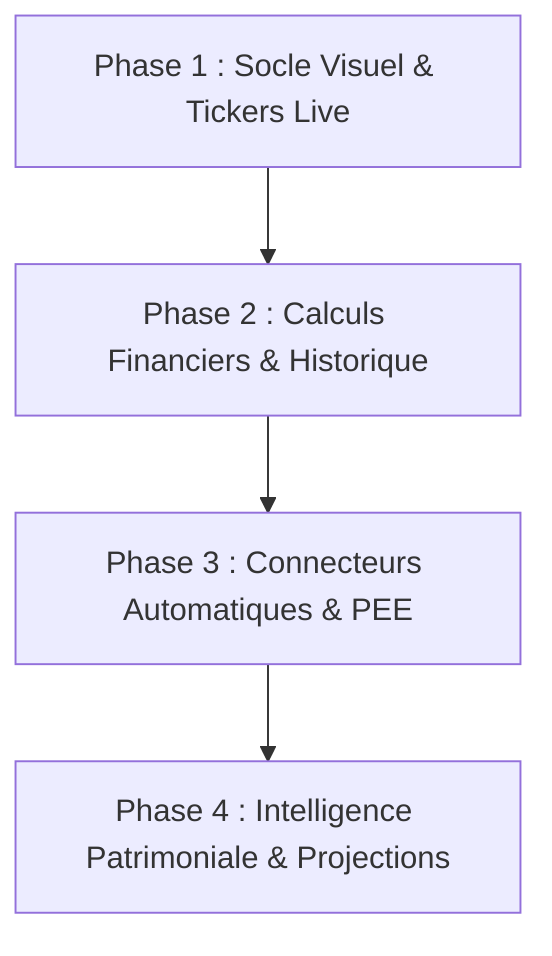

# Feuille de route & Architecture : Outil de Suivi de Patrimoine Personnel (Plan Initial)

Ce document définit la vision, l'architecture technique et les phases de déploiement pour concevoir un tracker de patrimoine moderne, automatisé et agréable à utiliser au quotidien.

---

## 1. Diagnostic : Pourquoi abandonne-t-on souvent un dashboard de patrimoine ?

Les outils "faits maison" (Excel, Notion, dashboards isolés) échouent généralement pour 3 raisons :
1. **La corvée de la saisie manuelle** : Dès qu'il faut se connecter à 5 banques pour reporter des chiffres, on repousse et on abandonne.
2. **La fragilité des connecteurs** : Des scripts de scraping qui cassent à la moindre mise à jour des banques ou des MFA/2FA constants.
3. **Le manque de feedback immédiat & d'esthétique** : Un outil austère ne donne pas envie de s'y connecter chaque semaine.

Notre stratégie repose donc sur :
- **Un résultat visuel immédiat (Quick Win)** dès la première étape.
- **Une couche de données hybride** : automatique là où c'est possible (cours boursiers en temps réel, API Open Banking gratuites), et fluide/sans friction pour le reste (PEE/Immobilier).
- **Une stack simple à exécuter localement** sans dépendance cloud payante obligatoire.

---

## 2. Architecture Technique Recommandée

### Option retenue : Fullstack moderne & modulaire
- **Backend / Data Pipeline** : **FastAPI (Python)**
  - *Pourquoi ?* Python est l'écosystème roi pour la finance : calculs financiers, intégration directe avec `yfinance` (actions, ETF, indices mondiaux), connecteurs de scraping légers (Playwright/BeautifulSoup pour PEE si besoin), et manipulation de données vectorielles/historiques.
  - Base de données : **SQLite** (embarqué, zéro config, exportable en un fichier) via **SQLAlchemy / SQLModel**.
- **Frontend / Dashboard** : **React + Vite + Tailwind CSS + Lucide Icons + Recharts / Tremor**
  - *Pourquoi ?* Un look fintech moderne (dark/light mode, cartes dynamiques, graphiques d'évolution fluide, treemap d'allocation, jauges de diversification).
- **Moteur de cotation en direct** :
  - Marchés boursiers & ETF : `yfinance` / Yahoo Finance API (gratuit, temps réel / 15 min de différé selon places).
  - Cryptomonnaies : CoinGecko / Binance API publique (gratuit, temps réel).

---

## 3. Plan d'Action par Phases (Progressif & Motivant)

### Phase 1 — Le Socle & "Quick Win" Visuel (Semaine 1)
*Objectif : Avoir un dashboard magnifique qui tourne sur votre machine avec vos vrais actifs boursiers et bancaires saisis une fois, et les prix qui bougent en temps réel.*
- Modèle de données unifié :
  - **Comptes / Enveloppes** : PEA, Compte Titres (CTO), Assurance Vie, PEE, Comptes courants, Livrets (A/LDDS), Crypto, Immobilier/Autres.
  - **Lignes d'actifs** : Ticker/Symbole (ex: `CW8.PA`, `AAPL`, `BTC-EUR`), quantité, PRU (Prix de Revient Unitaire), devise.
- Worker de rafraîchissement des cours boursiers en tâche de fond.
- Interface Dashboard :
  - Valeur nette totale (Net Worth) et variation journalière (€ et %).
  - Répartition visuelle par enveloppe (camembert / donut interactif).
  - Tableau des positions boursières avec cours en direct, plus/moins-values latentes.

### Phase 2 — Historique de Performance & Métriques Avancées
*Objectif : Ne pas seulement voir la valeur aujourd'hui, mais mesurer si vos investissements performent vraiment.*
- Enregistrement quotidien automatique des valorisations (snapshots historiques).
- Graphique d'évolution du patrimoine dans le temps (sur 1 mois, 6 mois, 1 an, Max).
- Calculs de rendement réels :
  - **TWR (Time-Weighted Return)** & **MWR / TRI (Taux de Rendement Interne)** pour neutraliser l'impact des apports/retraits.
  - Comparaison avec un indice de référence (Benchmark ex: S&P 500 ou MSCI World).

### Phase 3 — L'Automatisation des Données Externes
*Objectif : Zéro saisie récurrente pour les comptes bancaires et le PEE.*
- **Banques & Livrets** :
  - Intégration Open Banking (DSP2) via l'API gratuite de **GoCardless Bank Account Data** (ex-Nordigen, qui offre un accès gratuit aux comptes bancaires européens).
- **Plan Épargne Entreprise (PEE)** :
  - Étude du fournisseur (Amundi EE, Natixis Interépargne, Epsor, etc.) :
  - Script d'import automatisé (soit par lecture de relevé PDF/CSV semi-automatique en 1 clic, soit par connecteur de synchronisation sécurisé).

### Phase 4 — Stratégie & Allocation d'Actifs (L'outil décisionnel)
*Objectif : Transformer le dashboard passif en copilote d'investissement.*
- Matrice d'allocation cible vs réelle (ex: 70% Actions World, 15% Épargne Sécurité, 10% Immo, 5% Crypto).
- Recommandation de rééquilibrage automatique lors des nouveaux versements ("Où injecter mes 500 € ce mois-ci ?").
- Simulation de projection long terme (intérêts composés, indépendance financière / FIRE).

---

## 4. Vos Choix & Prochaines Décisions

> [!IMPORTANT]
> Pour adapter au mieux le démarrage, voici quelques précisions utiles :
> 1. **Vos enveloppes actuelles** : PEA chez Boursorama/PEE chez BNP Epargne entreprise, CTO,crypto et epargne chez Revolut, Livrets et compte courant chez BNP
> 2. **L'hébergement souhaité** : hébergement sur Home assistant OS (via docker + add-on) qui tourne dans un vieux PC chez moi
> 3. **Validation de la stack** : A l'aise techniquement ?
